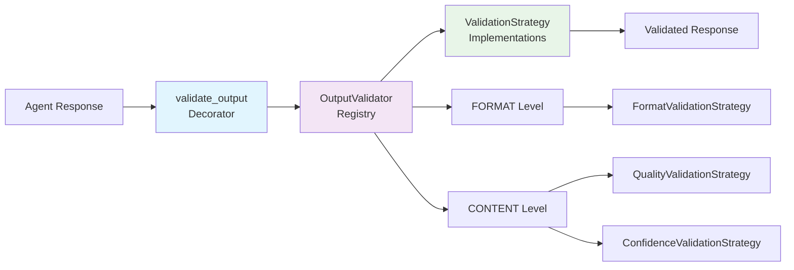

# Validation System Design Patterns

This diagram illustrates the three core design patterns used in the validation system: Registry, Strategy, and Decorator patterns working together.

## Pattern Interactions

1. **Decorator Pattern** (`validate_output`):
   - Wraps any function to automatically apply validation
   - Intercepts function results before returning to caller
   - Decides whether to return result or raise validation error

2. **Registry Pattern** (`OutputValidator`):
   - Maintains organized collections of validation strategies by level
   - Provides centralized strategy management and execution
   - Enables dynamic strategy registration and configuration

3. **Strategy Pattern** (`ValidationStrategy` implementations):
   - Defines interchangeable validation algorithms
   - Allows easy addition of new validation types
   - Encapsulates specific validation logic in separate classes

## How They Work Together

The **Decorator** catches function outputs → The **Registry** orchestrates validation → The **Strategies** perform specific checks → Results flow back through the **Decorator** to the caller.